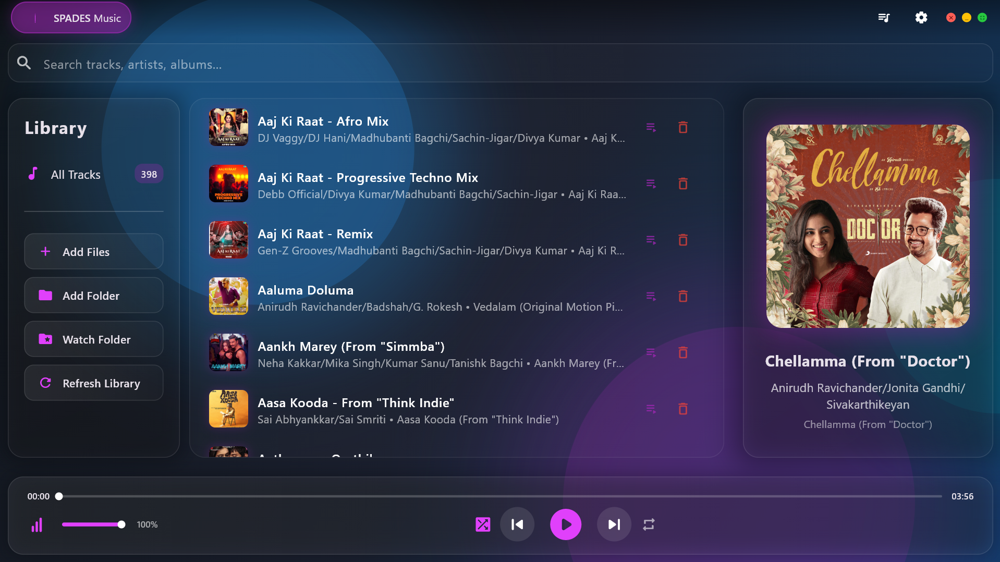

# SPADES Music App 🎵

> A free, offline Windows music player built with Flutter — no ads, no internet required, no account needed.


---

## 📸 Screenshots

<!-- Add your screenshots here -->


---

## ✨ Features

- 🎵 Play local music files completely offline
- 📁 Add individual files or entire folders
- 👀 Watch folder — automatically detects new songs
- 🔍 Search by song, artist or album
- 📝 Click song artwork to view synced lyrics powered by LRCLIB
- 🎨 Beautiful modern UI with acrylic blur effect
- 🚫 No ads, no tracking, no data collection
- 🆓 Completely free forever

---

## 📥 Download

Download SPADES Music App on the Microsoft Store:

[](https://apps.microsoft.com/detail/9P9L6P0QXZBL)

---

## 🛠️ Built With

- [Flutter](https://flutter.dev) — UI framework
- [Dart](https://dart.dev) — Programming language
- [LRCLIB](https://lrclib.net) — Lyrics fetching
- [audiotags](https://pub.dev/packages/audiotags) — Reading music metadata
- [audioplayers](https://pub.dev/packages/audioplayers) — Audio playback

---

## 🚀 Getting Started

### Prerequisites
- Flutter SDK
- Windows 10 or later

### Installation from source
```bash
# Clone the repository
git clone https://github.com/Anirudh675/SPADES-MUSIC-APP.git

# Navigate to project folder
cd SPADES-MUSIC-APP

# Install dependencies
flutter pub get

# Run the app
flutter run -d windows
```

---

## 📖 How to Use

1. Download and install from the Microsoft Store
2. Open SPADES Music App
3. Click **Add Files** to add songs or **Add Folder** to add a whole folder
4. Click any song to start playing
5. Use the playback controls at the bottom to play, pause, skip and adjust volume
6. Click the **song artwork** on the right to view synced lyrics
7. Use **Watch Folder** to automatically detect new songs added to a folder
8. Use the **search bar** to find any song, artist or album instantly

---

## 🗺️ Roadmap

- [ ] Equalizer
- [ ] Playlist support
- [ ] Dark and light theme toggle
- [ ] Mini player mode
- [ ] Sleep timer

---

## 👨‍💻 Developer

**Anirudh675**
- 16 year old self taught developer from Melbourne, Australia
- Built and published this app entirely for free with no formal training
- GitHub: [@Anirudh675](https://github.com/Anirudh675)

---

## 📄 License

© 2026 Anirudh675. All rights reserved. SPADES Music App™

---

## ⭐ Support

If you enjoy SPADES Music App please consider:
- Leaving a **review on the Microsoft Store**
- Giving this repository a **⭐ star on GitHub**
- Sharing it with your friends

Every star and review helps more people discover the app!
